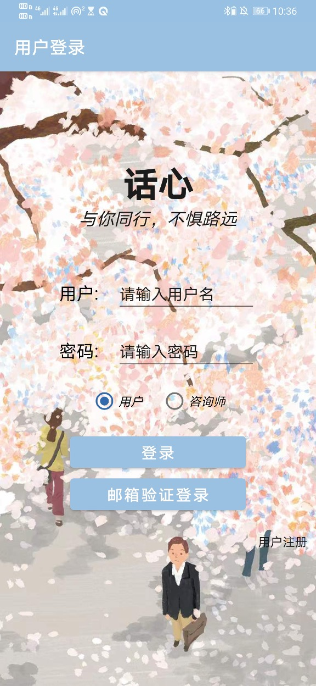
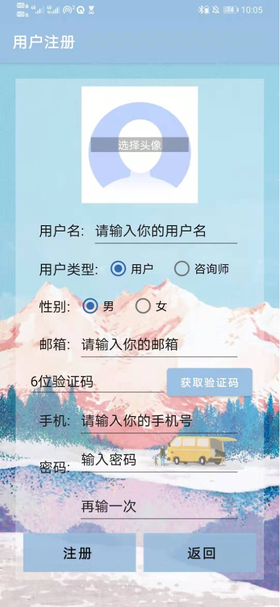

# online-counselling-platform
# online-counselling-platform
Android Studio and Spring Boot were used to implement the front and back end of the software, and MySQL was used to implement the database.
Implemented conversation, social media sharing, and counseling service reservation functions;
Implemented client-side and consultant-side.
MentalHealthAndroid is the front-end source code for huaxin application；
MentalHealthServer is the back-end source code；
mentalhealth_empty includes comments to build database。
# Display

